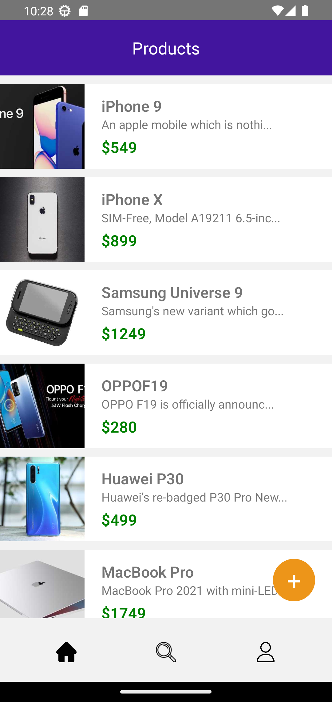
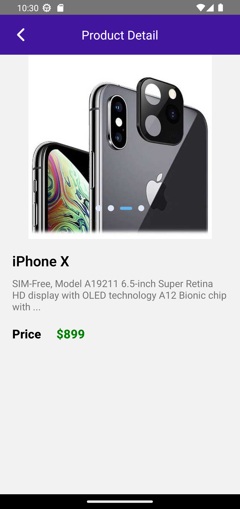
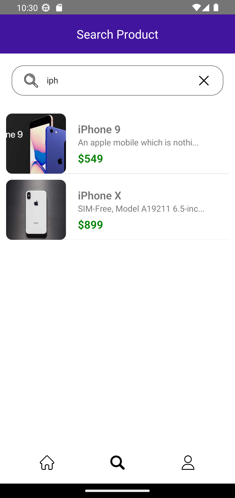
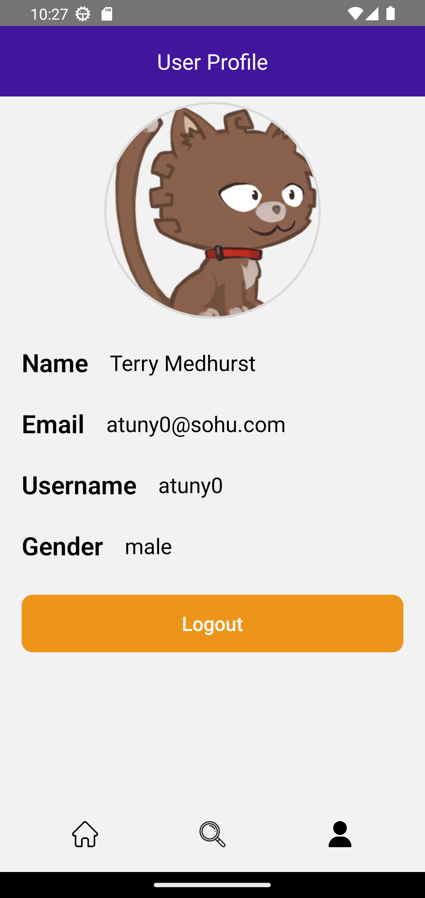
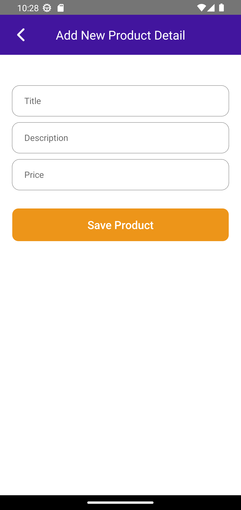

# About The Project: 
This is a sample application that allows users to search for different products, add new products, get details for particular product.


## Feature:
SearchProduct: Users can search different products from the search page.
Home Screen: The home screen displays the first 10 products,  when the user scrolls to the bottom app loads the next set of products from the server.
Add Product: Only valid logged-in users can add a product.
User Profile: Shows user profile details with the Logout option. Data is stored on a global store using redux.
Login: The user can log in to the app using credentials from https://dummyjson.com/users.

<br />

## Technologies Used
<li>React Native </li>
<li>JavaScript</li>
<li>Redux Toolkit</li>

## Installation guide:

To run the app locally, follow these steps:

1. Clone this repository and navigate into the project
   ```sh
   git clone https://github.com/bhushan38/Assignment.git
   cd Assignment
   ```
2. Install necessary packages and dependencies
   ```sh
   npm install
   ```
3. Run the app
   ```sh
   npm run android
   ```

## Screenshots
<details>
	<summary>View screenshots</summary>
<p align="left">
  
  
  
  
  
</p>
</details>

## References:
 - [Free icons.](https://www.flaticon.com/)
 - [Dummy API for product and user details.](https://dummyjson.com/)
 - [For environment configuration.](https://github.com/goatandsheep/react-native-dotenv)
 - [For environment configuration.](https://github.com/goatandsheep/react-native-dotenv)
 - [Storing local data securely in encrypted format.](https://github.com/emeraldsanto/react-native-encrypted-storage#readme)

